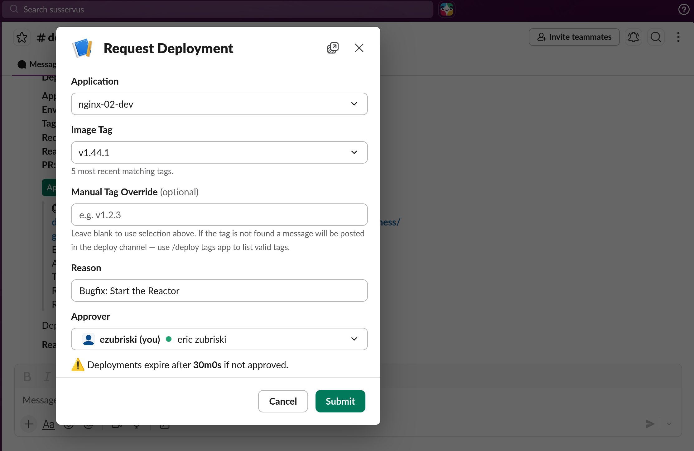
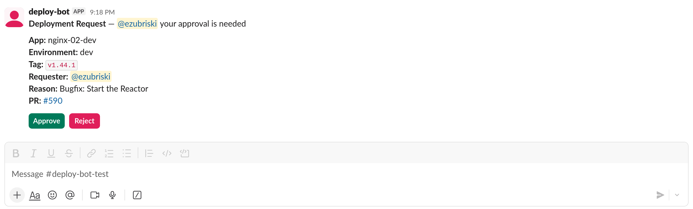
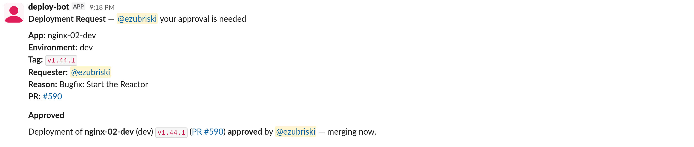

# deploy-bot

A Slack bot that gates Kubernetes deployments behind an approval workflow. Developers request deployments via `/deploy` or `@bot deploy`, approvers approve or reject with Slack buttons, and the bot creates and merges GitHub PRs that update kustomize image tags in a GitOps repo. Argo CD picks up merged PRs and deploys.

Built for organizations running Kubernetes + Argo CD that want centralized, auditable deployment control without leaving Slack.

## A deploy, start to finish

deploy-bot lives where your team already works -- a Slack channel -- and turns "shipping a change" into a short, visible conversation instead of a ritual involving the gitops repo, a YAML edit, a PR, a reviewer hunt, and a dashboard refresh.

**Asking for a deploy.** A developer types `/deploy` and gets a small form: pick an app, pick a tag, optionally name an approver, optionally write a one-line reason. Tag autocomplete shows what's actually in ECR, so there's no copy-pasting SHAs from another tab and no guessing whether the image exists yet.



Submit, and a single tidy message lands in the deploy channel: who's deploying what, to which environment, and why.



**Approving a deploy.** The approver sees that same message with two buttons: Approve and Reject. No links to click through, no PR to open, no branch to inspect. One click and the bot takes it from there -- merging the PR, posting the result back in the same thread, and quietly handing off to Argo CD. If they reject, the requester is told why, and the slot is freed for someone else.



**The channel as a status board.** Because every deploy -- requested, approved, rejected, expired, rolled back -- shows up in one place, the channel itself becomes the deployment log. New team members can scroll up and see the rhythm of the service. On-call can glance at it during an incident and know what changed in the last hour without opening a single dashboard. `/deploy list` answers "what's waiting on me?" and `/deploy history` answers "what shipped recently?" -- both without leaving the chat.

**Guardrails that stay out of the way.** Only one deploy of a given app can be in flight at a time, so two people can't accidentally race each other. Pending requests expire on their own if nobody approves them, instead of lingering forever as half-finished work. If something goes sideways, `/deploy rollback` re-ships the previous tag with one command. None of this needs explaining to new users -- they just bump into it the one time it matters.

**Mistakes are cheap.** Hit submit too soon? `/deploy cancel`. Approver went to lunch? `/deploy nudge`. Not sure a tag is real? `/deploy tags`.

The net effect: deploys stop being a context switch. They're a sentence in a channel, a button click, and a thread you can scroll back to next week.

## Why deploy-bot

- **No public network exposure.** Socket Mode (outbound WebSocket) and SQS long-polling. No ingress, no webhooks, no load balancer.
- **ECR push-triggered deploys.** One EventBridge rule captures all ECR pushes account-wide. The bot filters by app and tag pattern. Add a new app and it works immediately -- no EventBridge changes, no GitHub webhooks, no per-repo CI pipelines.
- **Batteries included.** Terraform module, Kustomize base, Slack app manifest, GitHub Action and CLI for config validation.
- **Simple app configuration.** Define apps in `config.json` and the bot picks them up on the next hot-reload. For self-service, optional [repo-sourced discovery](repo-sourced-app-discovery.md) lets app teams drop a `.deploy-bot.json` in their repo.
- **Convention over configuration.** With [enforced naming conventions](naming-conventions.md), app names and kustomize paths are derived from repository names. Onboarding a new app takes two lines of JSON.
- **Built for resilience.** Redis Streams consumer groups, in-memory buffer with backpressure, sweeper for expired deploys, automatic rebase on merge conflicts, GitHub reconciliation after data loss.
- **OpenTelemetry instrumented.** GitHub, Slack, AWS, and Redis I/O is observed via OTEL contrib libraries; metrics export to Prometheus by default, with standard OTEL env vars for routing to a collector. See [observability](observability.md).
- **Horizontal scaling.** Receiver and worker scale independently. Consumer groups ensure each event processes once.

## Architecture

```
Developer          Receiver          Redis Stream       Worker            GitHub / Argo CD
    |                  |                   |               |                     |
    |-- /deploy ------>|                   |               |                     |
    |   @bot deploy    |-- enqueue ------->|               |                     |
    |                  |<-- ack -----------|               |                     |
    |                  |                   |-- event ----->|                     |
    |                  |                   |               |-- create PR ------->|
    |                  |                   |               |                     |
Approver               |                   |               |                     |
    |-- Approve ------>|                   |               |                     |
    |                  |-- enqueue ------->|               |                     |
    |                  |                   |-- event ----->|                     |
    |                  |                   |               |-- merge PR -------->|
    |                  |                   |               |                     |-- deploy
    |                  |                   |               |                     |
ECR Push               |                   |               |                     |
    |  EventBridge --->|                   |               |                     |
    |  (SQS)           |-- enqueue ------->| ecr:events    |                     |
    |                  |                   |-- event ----->|                     |
    |                  |                   |               |-- create PR ------->|
    |                  |                   |               |   (auto-merge or    |
    |                  |                   |               |    request approval)|
```

Two processes share a single container image:

- **receiver** -- connects to Slack via Socket Mode, validates incoming events, and enqueues them to a Redis Stream. Also polls SQS for ECR push events and scans repos for app config. Stateless; run 2+ replicas.
- **worker** -- consumes events from both streams, prioritizing user events. Runs all business logic (GitHub API, ECR, audit logging). Run 2+ replicas; Redis Streams consumer groups ensure each event is processed once.

## Getting started

| Guide | Time | What you get |
|---|---|---|
| **[Quickstart](quickstart.md)** | ~30 min | IRSA roles, in-cluster Redis, no ECR events. Kick the tires. |
| **[Production setup](production-setup.md)** | ~1 hour | ElastiCache IAM auth, WORM audit bucket, CMK encryption, ECR push deploys, repo discovery. |

## Commands

### Slash commands

| Command | Description |
|---|---|
| `/deploy` | Open the deployment request modal |
| `/deploy <app-env>` | Open the modal pre-selected to an app |
| `/deploy list` | List all pending deployments (alias: `status`) |
| `/deploy history [app-env]` | Show recent completed deployments |
| `/deploy apps` | List all configured apps and their source |
| `/deploy conflicts` | List repo-sourced apps blocked by operator config |
| `/deploy tags <app-env>` | List the 20 most recent valid tags |
| `/deploy tags <app-env> <tag>` | Verify a specific tag exists in ECR |
| `/deploy cancel <pr>` | Cancel your own pending deployment |
| `/deploy nudge <pr>` | Re-ping the approver |
| `/deploy rollback <app-env>` | Re-deploy the previous approved tag |
| `/deploy help` | Show command help |

### @mention commands

All commands are available via `@bot <command>` in any channel. Responses are posted in-channel (threaded if in a thread).

| Command | Description |
|---|---|
| `@bot deploy <app-env> <tag> [@approver] [reason]` | Create a deploy PR with positional args |
| `@bot list` | List pending deployments |
| `@bot history [app-env]` | Show recent deploys |
| `@bot apps` | List configured apps |
| `@bot conflicts` | List config conflicts |
| `@bot tags <app-env>` | List recent tags |
| `@bot cancel <pr>` | Cancel your own deployment |
| `@bot nudge <pr>` | Remind the approver |
| `@bot rollback <app-env>` | Deploy the previous tag |
| `@bot help` | Show command help |
